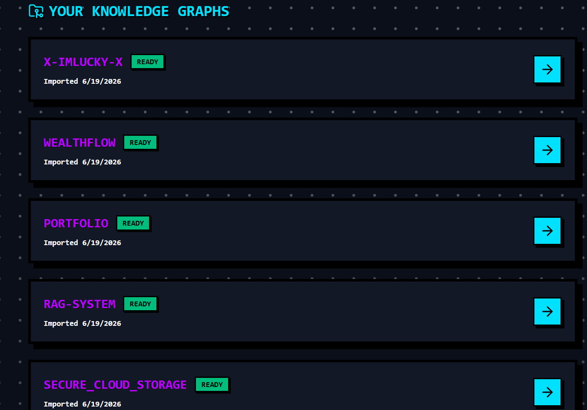

# 🌌 RepoWhisper

### AI-Powered Architectural Command Center for Modern Codebases

---

## 📖 Introduction

> **Stop reading codebases. Start understanding them.**

**RepoWhisper** is an AI-powered developer platform that automatically analyzes repositories, visualizes software architecture, evaluates code quality, and teaches developers how a codebase works through interactive AI explanations.

Whether you're onboarding to a new project, conducting architecture reviews, preparing for technical interviews, or exploring an open-source repository, RepoWhisper acts as your personal **Principal Engineer**.

---

## ✨ Features

### 🚀 Automated Repository Ingestion

Simply paste a GitHub repository URL, and RepoWhisper will:

- **Clone & index** the repository seamlessly.
- **Parse source files** using `Tree-sitter` for accurate AST parsing.
- **Build dependency relationships** across the entire codebase.
- **Extract architectural metadata** to map out components.
- **Generate embeddings** for deep semantic understanding.

### 🌌 Interactive 3D Architecture Graph

Visualize your codebase as a force-directed 3D knowledge graph.

- File dependency visualization and component relationship mapping.
- Interactive node exploration with color-coded architecture layers.
- Full zoom, rotate, and inspect functionality.

> Instead of navigating folders manually, developers can explore architecture visually.

### 📊 AI Architecture Scorecard

Every repository receives an AI-generated health assessment analyzing:

- Circular dependencies & unused/dead files.
- Structural complexity & code organization.
- Potential security concerns & maintainability indicators.

> Provides a health score from **0–100** along with actionable recommendations.

### 🎓 AI Walkthrough Tutor

Click any file in the architecture graph and receive an instant explanation:

- *What does this file do and why does it exist?*
- *Which files depend on it and how does it fit into the system?*
- *What would break if it changed?*

### 🎤 AI Mock Interviewer

Turn any repository into an interview simulator. RepoWhisper can:

- Generate architecture questions based on the ingested code.
- Ask targeted system design follow-ups.
- Test repository understanding and evaluate reasoning/trade-offs.

### ⚙️ Developer Control Center

Manage repositories and AI settings from a centralized dashboard. Configure AI model selection, response verbosity, analysis depth, and general user preferences.

---

## 🏗️ System Architecture

```text
GitHub Repository
        │
        ▼
Repository Ingestion Service
        │
        ▼
Tree-sitter AST Parsing
        │
        ▼
Dependency Graph Builder
        │
        ▼
Embedding Generator
        │
        ▼
Qdrant Vector DB + SQLite
        │
        ├────────────► AI Scorecard Engine
        │
        ├────────────► Walkthrough Tutor
        │
        └────────────► Mock Interview Engine
                              │
                              ▼
                    Next.js Frontend
                              │
                              ▼
                Interactive 3D Graph UI
```

---

## 🛠️ Tech Stack

### Frontend

| Layer | Technology |
|---|---|
| Framework | Next.js 15 (Turbopack), React |
| Styling & Animation | Tailwind CSS, Framer Motion |
| 3D Visualization | React Force Graph 3D, Three.js |
| Authentication | NextAuth |

### Backend

| Layer | Technology |
|---|---|
| Framework | FastAPI (Python) |
| Database | SQLite |
| Vector Store | Qdrant Local |
| Parser | Tree-sitter |

### AI Layer

| Layer | Technology |
|---|---|
| Orchestration | LangChain |
| LLMs | Groq Models, Google Gemini Models |
| Architecture | RAG & Vector Embeddings |

### Infrastructure

| Layer | Technology |
|---|---|
| Integrations | GitHub OAuth |
| Security | SlowAPI Rate Limiting |

---

## 🎨 Design Philosophy

RepoWhisper uses a custom **Cyberpunk Brutalism** design language to make code exploration feel like navigating a futuristic command center rather than reading documentation.

### Synthetix Design System

| Element | Specification |
|---|---|
| **Background Canvas** | Deep Space Obsidian `#0B0F19` |
| **Primary Accent** | Electric Purple `#BD00FF` |
| **Secondary Accent** | Bright Cyan `#00E0FF` |
| **Borders** | Hard `4px` Solid Black |
| **Shadows** | Brutalist Hard Rigid Drop Shadows |

---

## 🎯 Use Cases

- **New Team Members** — Understand large codebases in minutes instead of days.
- **Open Source Contributors** — Quickly discover architecture before making contributions.
- **Engineering Managers** — Review repository health and identify structural technical debt.
- **Students** — Learn how real-world production software systems are structured.
- **Interview Candidates** — Practice system design discussions using actual enterprise repositories.

---

## 📸 Screenshots

#### Landing Page


#### Repository Dashboard & 3D Knowledge Graph




#### Architecture Scorecard & AI Tutor


---

## 🚀 Getting Started (Local Run)

### 1. Clone Repository

```bash
git clone https://github.com/X-ImLucky-X/RepoWhisper.git
cd RepoWhisper
```

### 2. Frontend Configuration & Setup

1. **Install Frontend Dependencies**:
   ```bash
   cd frontend
   npm install
   ```
2. **GitHub OAuth Configuration**:
   - Go to your GitHub profile: **Settings** -> **Developer settings** -> **OAuth Apps** -> **Register a new application**.
   - **Application name**: `RepoWhisper Local`
   - **Homepage URL**: `http://localhost:3000`
   - **Authorization callback URL**: `http://localhost:3000/api/auth/callback/github`
   - Click register, copy the **Client ID**, and generate a new **Client Secret**.
3. **Environment Setup**:
   Create a `.env.local` file inside the `frontend/` directory based on the `.env.example` template:
   ```env
   GITHUB_ID="your_github_oauth_client_id"
   GITHUB_SECRET="your_github_oauth_client_secret"
   NEXTAUTH_SECRET="any_random_secure_string_for_sessions"
   NEXTAUTH_URL="http://localhost:3000"
   ```
4. **Start the Frontend Developer Server**:
   ```bash
   npm run dev
   ```

### 3. Backend Configuration & Setup

1. **Create Virtual Environment & Install Dependencies**:
   ```bash
   cd ../backend
   python -m venv venv
   # On Windows:
   venv\Scripts\activate
   # On macOS/Linux:
   source venv/bin/activate
   
   pip install -r requirements.txt
   ```
2. **Environment Setup**:
   Create a `.env` file inside the `backend/` directory based on the `.env.example` template:
   ```env
   DATABASE_URL="sqlite:///./repowhisper.db"
   GOOGLE_API_KEY="your_google_gemini_api_key"
   GROQ_API_KEY="your_groq_api_key"
   ```
3. **Run Database Migrations**:
   ```bash
   alembic upgrade head
   ```
4. **Start the FastAPI Backend Server**:
   ```bash
   uvicorn app.main:app --port 8000 --reload
   ```

Now, open your browser and navigate to `http://localhost:3000` to access the application.

---

## 👨‍💻 Author

**Lakshya Kumar Singh**  
Passionate about AI, software engineering, system design, and building tools that help developers understand complex systems faster.

- **GitHub:** [@X-ImLucky-X](https://github.com/X-ImLucky-X)
- **LinkedIn:** [Lakshya Kumar Singh](https://www.linkedin.com/in/lakshya-kumar-singh-62142128b/)

---

## ⭐ Why RepoWhisper?

Modern codebases are becoming larger, more distributed, and harder to understand. **RepoWhisper** transforms raw repositories into visual, searchable, and explainable systems — giving developers profound architectural insight instead of forcing them to manually reverse-engineer thousands of lines of legacy code.

> **Understand architecture. Faster. Smarter. Visually.**